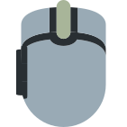

# Logitech M720 Button Configuration for Linux

This script can be used to configure mouse button mappings of a Logitech M720 mouse temporary.

The configuration is done via the HID++ protocol described in these documents:

 * [Logitech HID++2.0 Draft Specification](https://lekensteyn.nl/files/logitech/logitech_hidpp_2.0_specification_draft_2012-06-04.pdf)
 * [special keys and mouse buttons](https://lekensteyn.nl/files/logitech/x1b04_specialkeysmsebuttons.html#divertedButtonsEvent)

This script is created for personal use only and may or may not work for your device. Use at your own risk.

# How to Use

## Installation

Clone the repository and install this package with pip:

```
$ pip install --user -e /path/to/logitech-m720-config
```

This installs `m720-config` to `~/.local/bin`.

### Troubleshooting

On `ubuntu` the above installation might fail due to a different `PYTHONPATH` configuration. You may use the following *workaround* (use with caution, it is a hack!)

```
$ sudo apt-get install python3-pip
$ cd path-to-this-repo
$ PYTHONPATH="./lib" pip3 install --user -e .
$ pip3 install --user pyudev
$ ~/.local/bin/m720-config
```

## Run the script

This script will map `Button 8` on the thumb button by default.

Run in a terminal:

```
$ m720-config
```

> Make sure `~/.local/bin` is in your `PATH` variable

## Create your own configuration

Tweak the source code in `m720_config/__init__.py` to adjust the configuration. Specifically, the remapping is done in [line 155 of `__init__.py`](https://github.com/fin-ger/logitech-m720-config/blob/master/m720_config/__init__.py#L155).

### So, how does it work?

When running `m720-config` you get a `CID INFO` printed to the terminal which looks like this:

```
### CID INFO ###
  CID    TID  virtual persist divert reprog fntog hotkey fkey  mouse pos group gmask      rawXY
0x0050 0x0038 False   False   False  True   False False  False True  0   1     0b00000001 False
0x0051 0x0039 False   False   False  True   False False  False True  0   1     0b00000001 False
0x0052 0x003A False   True    True   True   False False  False True  0   2     0b00000011 True 
0x0053 0x003C False   True    True   True   False False  False True  0   2     0b00000011 True 
0x0056 0x003E False   True    True   True   False False  False True  0   2     0b00000011 True 
0x005B 0x003F False   True    True   True   False False  False True  0   2     0b00000011 True 
0x005D 0x0040 False   True    True   True   False False  False True  0   2     0b00000011 True 
0x00D0 0x00AD False   True    True   True   False False  False True  0   2     0b00000011 True 
0x00D7 0x00B4 True    False   True   False  False False  False False 0   3     0b00000000 True 
```

A `CID` is a control-ID which identifies a mouse button. To remap a button to another button, you first have to get the control-ID of the button you aim to remap (e.g. the thumb button with CID `0xD0`) and the control-ID of the button you aim to imitate (e.g. button 8 with CID `0x53`). To map CID `0xD0` to `0x53` you now have to create a CID reporting.

```python
buttons.set_cid_reporting (0xD0, False, False, True, True, False, False, 0x53)
```

If you just want to remap your mouse buttons, leave the other parameters as is. You can find documentation on what the other parameters are controlling [here](https://lekensteyn.nl/files/logitech/x1b04_specialkeysmsebuttons.html#setCidReporting).

### Button CID mapping

| CID    | Button                 |
|--------|------------------------|
| `0x50` |    |
| `0x51` |    |
| `0x52` |    |
| `0x53` |   |
| `0x56` |   |
| `0x5B` |   |
| `0x5D` |   |
| `0xD0` |  |
| `0xD7` | unknown                |

## Check your configuration

Use `xev | grep button` to monitor your changes to your mouse button mapping.

# How to Get Gestures On Linux?

You can use [Easystroke](https://github.com/thjaeger/easystroke/wiki) to add gesture support to your mouse. Use the thumb button as your gesture button and the behavior should be similar to that created by Logitech Options.
